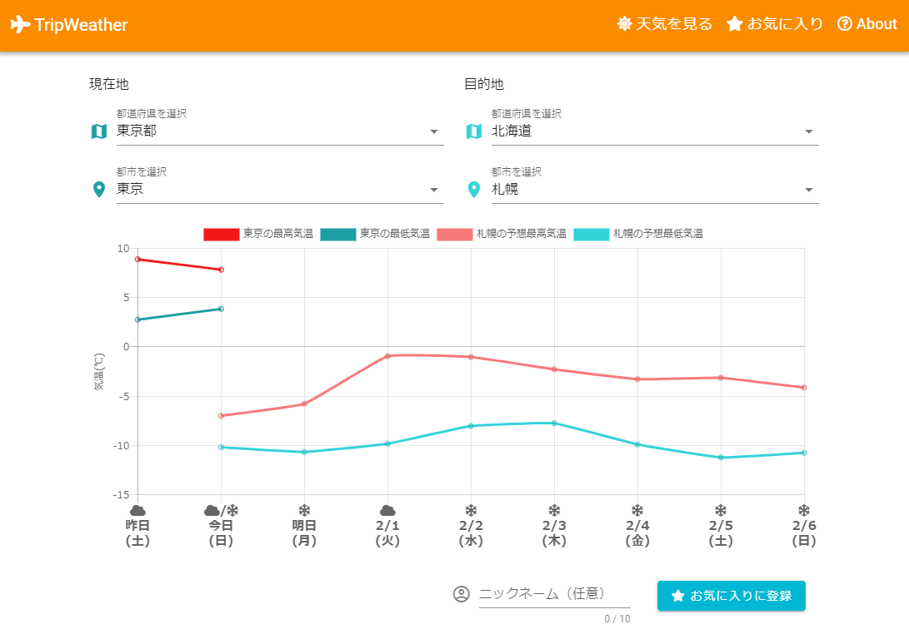
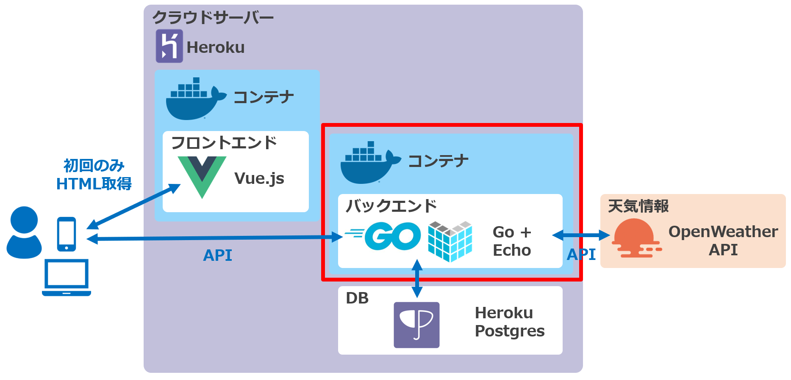

# TripWeather
旅行先のこの先一週間の天気予報を現在地と比較して見ることができるWebサイトです。

現在地・目的地をお気に入りに登録しておくことで、次回以降は簡単に天気予報を確認することができます。

レスポンシブ対応のため、スマホ/PCどちらからでも利用可能です。
 

### サイトURL
https://trip-weather-frontend.herokuapp.com/
 

### 構成図
このリポジトリは以下赤枠部分のコードを含みます。
 

関連するリポジトリは以下の2つです。
- フロントエンド（Vue.js）  
  https://github.com/yakitori99/trip-weather-frontend

- バックエンド②（Ruby on Rails版。機能はGo+Echo版と同様）  
  https://github.com/yakitori99/trip-weather-backend-rails

### 主な使用技術（アプリケーション全体）
#### フロントエンド
- Vue.js 2.6
  - Vuetify (UIライブラリ)
  - vue-toasted (トースト表示用ライブラリ)
- chart.js (グラフ表示)
- axios (非同期通信)
- nginx (Webサーバ)

#### バックエンド①
- Go 1.16
  - Echo (Webフレームワーク)
  - GORM (ORMフレームワーク)
  - logrus (ログ出力用ライブラリ)
  - go-simplejson (jsonのパース用ライブラリ)
  - apitest (APIテスト用ライブラリ)

#### バックエンド②
- Ruby 3.0 / Ruby on Rails 6.1
  - Puma (Web/アプリケーションサーバ)
  - Faraday (HTTP通信用ライブラリ)
  - parallel (並行処理用ライブラリ)

※バックエンド①と②は全く同じ機能です。学習のため、2つの言語でそれぞれ作成しました。

#### インフラ
- Heroku
- Docker / docker-compose
- SQLite

#### API
- OpenWeather API
 

### 機能一覧（アプリケーション全体）
- 天気表示機能
  - 現在地の昨日、今日の天気
  - 目的地の今日の天気、明日から1週間の天気予報
- お気に入り登録機能
- お気に入り一覧表示機能
  - ページネーション
  - ソート
- お気に入りから選んで天気を表示する機能
 

### 工夫したこと（バックエンド：Go+Echo）
- 高速化のため、2つ以上のAPIを呼び出すときは並行処理とした
- テストコードを用いて、単体テスト・APIテストを自動化した
- Dockerイメージ軽量化のため、マルチステージビルドを行い、リリース用イメージにはビルド済み実行ファイルのみを置いた

### やっていないこと（バックエンド：Go+Echo）
- ログイン機能はなし
  - 天気を見るだけのアプリでユーザ登録をさせたくないので
- WebAPIの機能として、基本的に入力値のチェックなし
  - 自作のフロントエンドからのみ呼び出す処理であり、想定外の値が来ることはないため
  - ただし、念のため、登録系のAPIのみ不整合データが登録できないようなチェック処理あり
- DBサーバを分けていない
  - 通常分けるべきだが、簡略化のためSQLiteを利用